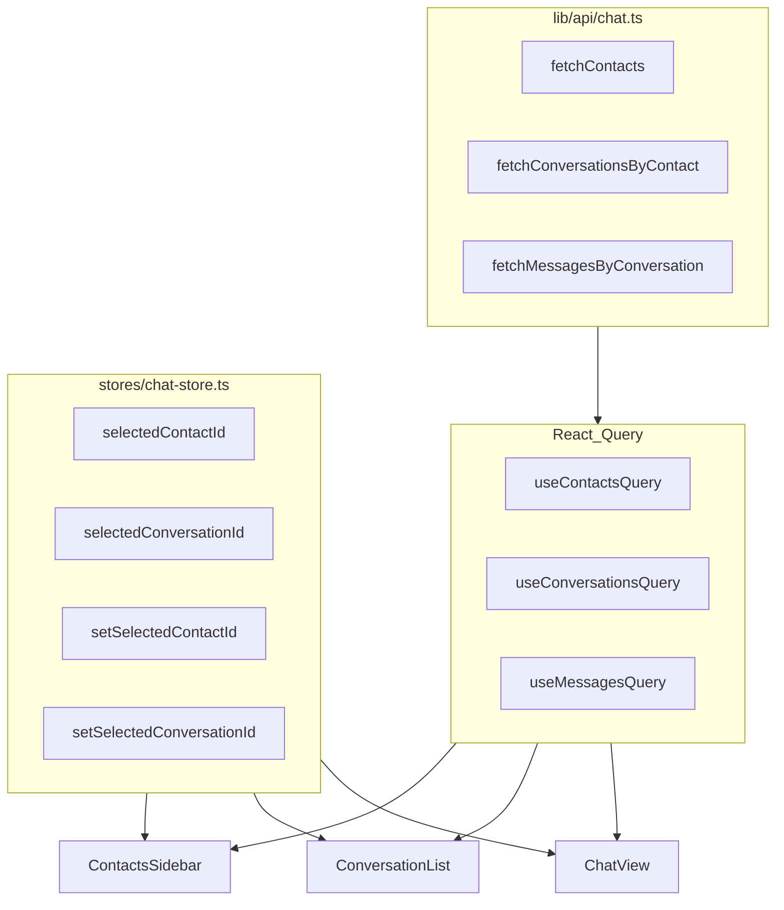

# Chat 数据层：Zustand + React Query 规划

## 目标边界

- **Zustand**：`selectedContactId`、`selectedConversationId`（及后续若需要的派生规则，如「切换联系人时清空会话」可放在 store action 或专用 hook 里）。移动端 `showContacts` / `showConversations` 仍建议留在 `[chat-layout.tsx](apps/web/src/components/chat/chat-layout.tsx)` 作纯 UI 状态（与「业务数据 store」解耦）；若你希望一并进 store，可再扩一行状态即可。
- **React Query**：联系人列表、按 `contactId` 的会话列表、按 `conversationId` 的消息列表；**暂无真实接口**：`queryFn` 内 `await` 短延迟 + 返回现有 mock 常量（从 `[lib/mock-data](apps/web/src/lib/mock-data)` 读出），便于日后替换为 `ofetch` 调用。
- **类型与 mock**：`[ai-employees.ts](apps/web/src/lib/mock-data/ai-employees.ts)`、`[conversations.ts](apps/web/src/lib/mock-data/conversations.ts)`、`[messages.ts](apps/web/src/lib/mock-data/messages.ts)` 继续作为 **类型定义 + 静态种子**；新增薄层 **API 模块** 封装异步形状，避免组件直接 `import CONVERSATIONS`。

## 架构关系（简图）

## 建议新增文件

| 路径                                                                                                  | 职责                                                                                                                                                                          |
| --------------------------------------------------------------------------------------------------- | --------------------------------------------------------------------------------------------------------------------------------------------------------------------------- |
| `[apps/web/src/lib/query-keys/chat.ts](apps/web/src/lib/query-keys/chat.ts)`                        | 集中定义 `chatKeys.contacts()`、`chatKeys.conversations(contactId)`、`chatKeys.messages(conversationId)`，避免魔法字符串                                                                  |
| `[apps/web/src/lib/api/chat.ts](apps/web/src/lib/api/chat.ts)`                                      | `fetchContacts()`、`fetchConversationsByContactId(contactId)`、`fetchMessagesByConversationId(conversationId)`：内部 `delay(200~400)` + 返回当前 mock 数据；日后只改此文件接真实 URL              |
| `[apps/web/src/hooks/use-chat-queries.ts](apps/web/src/hooks/use-chat-queries.ts)`（或拆成 3 个 hook 文件） | 封装 `useQuery`，`queryKey` 接 `chatKeys`，`queryFn` 调上述 API                                                                                                                     |
| `[apps/web/src/stores/chat-store.ts](apps/web/src/stores/chat-store.ts)`                            | 与 `[artifact-store.ts](apps/web/src/stores/artifact-store.ts)` 一致风格：`create()`，初始 `selectedContactId` 使用现有 `DEFAULT_SELECTED_CONTACT_ID`，`selectedConversationId` 初始 `null` |

可选：在 `[main.tsx](apps/web/src/main.tsx)` 为 `QueryClient` 配置 `defaultOptions.queries`（如 `staleTime`），减少开发期无意义的重复 refetch；占位阶段非必须。

## 组件迁移顺序（降低风险）

1. **新建 store + query hooks + api**，不删 mock 文件。
2. **替换 Context**：`[chat-context.tsx](apps/web/src/components/chat/chat-context.tsx)` 可改为对 `useChatStore` 的薄封装（保持 `useChatContext` 名称），或让各组件直接 `useChatStore`；`[chat-layout.tsx](apps/web/src/components/chat/chat-layout.tsx)` 去掉 `useState` 与 `chatContext.Provider`，仅保留布局与移动端 Sheet。
3. **ContactsSidebar / ContactItem**：`useContactsQuery`（或 contacts 来自 `fetchContacts` 的列表）；选中逻辑改 `useChatStore.getState().setSelectedContactId`；`PRIMARY_CURATOR` 等仍可从 mock 常量组合展示（或 API 返回结构里已含 curator 段）。
4. **ConversationList**：`useConversationsQuery(selectedContactId)`；保留现有「无会话时清空 `selectedConversationId`」的 `useEffect`，改为依赖 **query 返回的列表**（`data ?? []`），并在 `isLoading` 时避免误清空（仅在 **success 且 length===0** 时 reset）。
5. **ChatView**：`useMessagesQuery(selectedConversationId)`；会话标题仍用 `conversations` 缓存里 `findById` 或单独 `useQuery` 的 `select`，避免再调 `getConversationById` 读静态表；`getContactById` / `getPeerProfileById` 可先改为基于 **contacts 查询结果** 的纯函数（或留在 mock 里仅作工具函数，入参改为列表）。
6. **CreateGroupDialog**：继续用 `AI_EMPLOYEES` 或后续 `fetchPickableEmployees` 的 query（占位阶段可仍 import mock）。

## 与真实接口对接时的替换点

- 只改 `[lib/api/chat.ts](apps/web/src/lib/api/chat.ts)`（及鉴权 header、baseURL）。
- 若列表依赖筛选条件，给 queryKey 加参数即可触发重新请求。
- 发送消息、新建会话等 **mutation** 再在同目录增加 `useMutation` + `invalidateQueries(chatKeys.conversations(contactId))` 等（本次占位可只列 TODO，不实现 mutation）。

## 风险与注意点

- **StrictMode** 下开发环境 effect 会双跑：ConversationList 的 reset 逻辑需幂等（仅当 id 非 null 时再 `set(null)`，你们已有类似判断）。
- **enabled**：`useConversationsQuery` 在 `!selectedContactId` 时 `enabled: false`；`useMessagesQuery` 在 `!selectedConversationId` 时 `enabled: false`，避免无效请求键。

