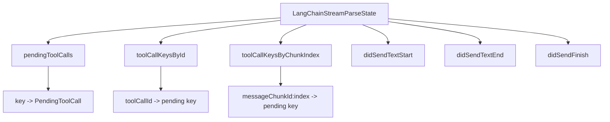
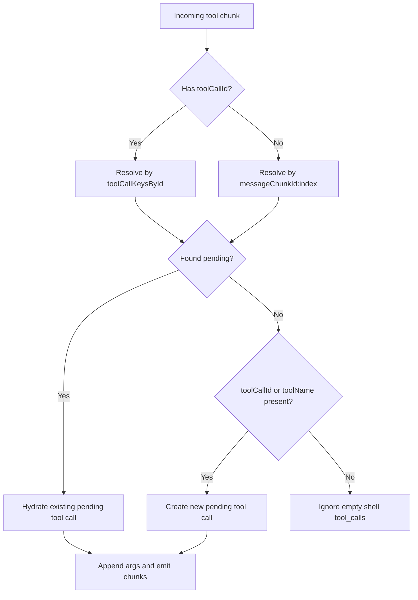
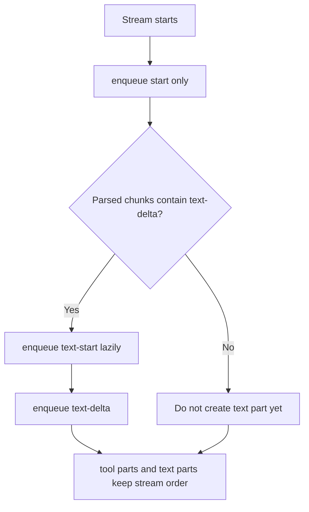
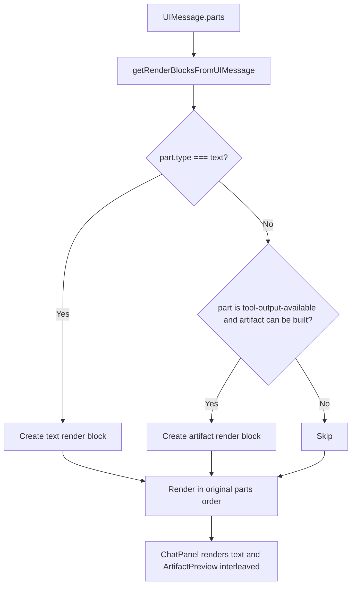

# LangChain Stream Parser Flow

基于当前实现：

- `apps/web/src/lib/chat/langchain-chat-transport.ts`
- `apps/web/src/lib/chat/langchain-stream-parser.ts`
- `apps/web/src/lib/chat/message-utils.ts`
- `apps/web/src/lib/chat/artifact-utils.ts`

## Overview

```mermaid
flowchart TD
  A[Backend SSE response] --> B[LangChainChatTransport.processResponseStream]
  B --> C[reader.read loop]
  C --> D[TextDecoder decode into buffer]
  D --> E[Split buffer by SSE boundary]
  E --> F[flushEvent eventText]
  F --> G[Collect all data: lines]
  G --> H{data === [DONE]?}
  H -- Yes --> I[enqueue text-end if text started]
  I --> J[enqueue finish]
  J --> K[close stream]
  H -- No --> L[JSON.parse data]
  L --> M[parseLangChainPayloadToChunks]

  M --> N[buildToolOutputChunk]
  M --> O[buildToolInputChunks]
  M --> P[extractAssistantText]

  N --> Q{ToolMessage?}
  Q -- Yes --> R[Resolve tool_call_id]
  R --> S[Find pending input by toolCallId]
  S --> T[Emit tool-output-available or tool-output-error]

  O --> U{AIMessageChunk?}
  U -- Yes --> V[Read tool_calls]
  V --> W[Hydrate pending tool call]
  W --> X[Read tool_call_chunks]
  X --> Y{No valid tool_call_chunks?}
  Y -- Yes --> Z[Fallback to invalid_tool_calls]
  Y -- No --> AA[Use tool_call_chunks]
  Z --> AB[Resolve pending by toolCallId or messageChunkId:index]
  AA --> AB
  AB --> AC[Append args delta]
  AC --> AD{First delta?}
  AD -- Yes --> AE[Emit tool-input-start]
  AD -- No --> AF[Continue]
  AF --> AG{inputText JSON.parse succeeds?}
  AE --> AG
  AG -- Yes --> AH[Emit tool-input-available]
  AG -- No --> AI[Wait for more chunks]

  P --> AJ{content has text?}
  AJ -- Yes --> AK[Return text-delta chunk]
  AJ -- No --> AL[No text chunk]

  T --> AM[Return UIMessageChunk list]
  AH --> AM
  AK --> AM
  AL --> AM
  AM --> AN{contains text-delta?}
  AN -- Yes --> AO[enqueue text-start lazily]
  AO --> AP[enqueue parsed chunks in order]
  AN -- No --> AP
  AP --> AQ[useChat consumes UIMessageChunk]
```

## Parser State



## Tool Association Rules



关键点：

- `tool_call_id` 是工具的稳定主键
- `messageChunkId:index` 是流式分片阶段的回挂键
- 空壳 `tool_calls` 不会创建新的 fallback pending

## Text Ordering Rules



关键点：

- 不在流开始时立即发送 `text-start`
- 只有首次出现 `text-delta` 时才创建 text part
- 这样可以避免工具块总是被挤到文本后面

## UI Rendering Order



关键点：

- 不再把整条 assistant message 的文本合并后统一渲染
- 而是按 `message.parts` 原始顺序逐块渲染
- 这保证了展示顺序可以接近真实流式输出：
  1. 前置文本
  2. 工具产物
  3. 后置文本

## Output Chunks

- Text:
  - `start`
  - `text-start`
  - `text-delta`
  - `text-end`
  - `finish`
- Tool input:
  - `tool-input-start`
  - `tool-input-delta`
  - `tool-input-available`
- Tool output:
  - `tool-output-available`
  - `tool-output-error`

## Summary

- `transport` 负责：读流、切帧、懒创建 text part、分发 chunk
- `stream-parser` 负责：识别 LangChain 消息、聚合工具参数、输出标准 `UIMessageChunk`
- `message-utils` / `artifact-utils` 负责：把 `UIMessage.parts` 转成按顺序可渲染的文本块和 artifact 块
